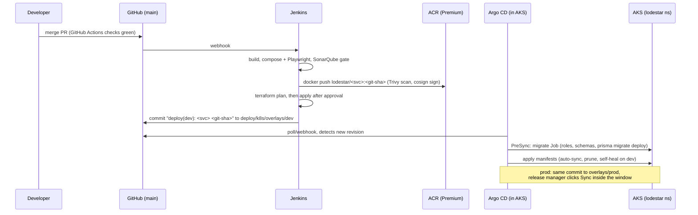

# GitOps delivery: GitHub Actions bumps tags, Argo CD syncs

> **What is live, and what is not.** The live path is **GitHub Actions → GHCR → the demo VM**. Today the VM serves the public URL with the compose stack (`deploy/azure-demo`), which polls for the newest green run and deploys it. The same run also commits the new image tags to `deploy/k8s/overlays/demo`, so **Argo CD (core mode) on k3s on the same VM** can take over: "Demo on k3s" below. The VM has 4 GiB, so k3s and compose never run the app at the same time: the cut-over stops compose, the rollback stops k3s. The AKS part (`envs/dev`, `envs/prod`, `overlays/dev|prod`, Istio, Front Door, Key Vault, Terraform `envs/dev|prod`) is **target architecture that was not applied**; see [`infra/README.md`](../../infra/README.md). Jenkins (`Jenkinsfile`) is not on the live path; it is kept for reference only, with the AKS design below.

The repository URL is written once, in [`repo/kustomization.yaml`](repo/kustomization.yaml) (a kustomize component). Every Application and AppProject here says `REPO_URL` and gets the value at build time, so apply these folders with `kubectl apply -k`, never `-f`.

## Demo on k3s

```
GitHub main ──▶ GitHub Actions deploy-demo: checks ─▶ changed images → ghcr.io/adagard-trios/lodestar-<svc>:<sha>
                                                 ─▶ release: every overlay image at :<sha>, kustomize edit set image
                                                    in deploy/k8s/overlays/demo, commit [skip ci]
Argo CD core (k3s on the VM) polls main ──▶ Sync: Postgres, then the migrate Job (hook), then the services
ingress-nginx (80/443, hostNetwork) + cert-manager (Let's Encrypt) ──▶ gateway ──▶ /, /field/, /odata/v4/, /auth/, /ws/, /ocr/
```

What `deploy/k8s/overlays/demo` is: `overlays/local` (the kind setup: in-cluster Postgres, Redis and Keycloak, the NGINX gateway, no Azure workload identity, no Key Vault CSI, no Istio) plus, for plain k3s on one node:
- no KEDA (the agent and sync ScaledObjects go), no HPAs, one replica of everything, requests sized for 4 GiB (~2.2 GiB in all);
- the OCR service (`platform/ocr.yaml`; `base/` has none yet);
- no Secret from git: every dev-only Secret of `overlays/local` is deleted, and the real ones are created on the VM from its `.env` by [`deploy/azure-demo/k3s-secrets.sh`](../azure-demo/k3s-secrets.sh);
- the migrate + seed Job runs as an Argo CD Sync hook, reads the competition CSVs from the ConfigMap `lodestar-data` (created on the VM by the same script; optional) and `DEMO_DATE` from the overlay;
- Keycloak in production mode, as in `compose.prod.yml`;
- an Ingress with a Let's Encrypt certificate in front of the gateway; the host name is in `overlays/demo/platform/host.env` only;
- image tags in `overlays/demo/kustomization.yaml`, the only file CI rewrites.

Render it without a cluster:

```bash
kubectl kustomize --load-restrictor LoadRestrictionsNone deploy/k8s/overlays/demo
```

### Memory budget on the current VM (Standard_B2als_v2: 2 vCPU, 4 GiB + 4 GiB swap)

| Part | Memory | When |
|---|---|---|
| compose stack (today's live path) | ~1.5 GB idle | until the cut-over; **stopped** by it |
| k3s (server, containerd, CoreDNS, metrics-server, local-path) | ~450 MB | from step 0 |
| Argo CD core (controller, repo-server, Redis; no UI server, Dex or notifications) | ~300 MB (limits: 416 MiB) | from step 3 |
| cert-manager | ~100 MB | from step 2 |
| ingress-nginx | ~100 MB | from the cut-over |
| the app in k3s (17 pods) | ~1.6 GB idle (requests 2.2 GiB) | from the cut-over |

- **During setup (steps 0–5)** compose keeps serving: compose ~1.5 GB + k3s, Argo CD core and cert-manager ~0.85 GB ≈ 2.4 GB. It fits.
- **After the cut-over**: k3s ~0.45 + Argo CD ~0.3 + cert-manager and ingress-nginx ~0.2 + app ~1.6 ≈ **2.5–2.6 GB**. It fits, with the swap for peaks (Keycloak's first start, a planning run).
- **Both at once does not fit** (~4 GB before any load). Running the app in k3s **replaces** compose; it is one or the other, and the Application is only created after compose has been stopped (step 6). The rollback (step 7) is the reverse.
- If pods stay `Pending` (`kubectl describe pod` says *Insufficient memory*) or the VM swaps hard, roll back and resize to `Standard_B2ms` (8 GiB, `vm_size` only: an in-place update).

### 0. k3s on the VM (by hand)

Do **not** set `install_k3s = true` in Terraform for this VM: it changes the VM's cloud-init (`custom_data`), and Terraform then **replaces** the VM (new disk; the compose data and `.env` are gone). `install_k3s` is only for a brand-new VM. On the existing VM, install k3s by hand, without Traefik and its service load balancer (nothing in k3s may take 80/443 while compose runs), and with a 200 MiB hard-eviction floor so the kubelet evicts a pod before the VM runs out of memory:

```bash
ssh lodestar@<fqdn>
curl -sfL https://get.k3s.io | sudo INSTALL_K3S_EXEC="--disable=traefik --disable=servicelb --write-kubeconfig-mode=600 --kubelet-arg=eviction-hard=memory.available<200Mi,nodefs.available<10%" sh -
sudo systemctl status k3s --no-pager | head -5
free -m                                             # compose still running: ~2 GB used
```

(`eviction-hard` replaces the kubelet's whole default list, hence the disk threshold next to the memory one. k3s runs the kubelet with `--fail-swap-on=false`, so the swap file can stay.)

The steps below run **on the VM** (`ssh lodestar@<fqdn>`), from `/opt/lodestar`. They need no Azure login; the GitHub and GHCR tokens in step 4 are only needed if the repo or the packages are private.

### 1. kubectl and helm

```bash
mkdir -p ~/.kube && sudo cp /etc/rancher/k3s/k3s.yaml ~/.kube/config && sudo chown "$USER" ~/.kube/config && chmod 600 ~/.kube/config
kubectl get nodes                                   # one node, Ready
curl -fsSL https://raw.githubusercontent.com/helm/helm/main/scripts/get-helm-3 | bash
cd /opt/lodestar && git remote set-url origin https://github.com/Adagard-Trios/Lodestar.git && git pull
```

### 2. cert-manager and the Let's Encrypt issuers

```bash
helm repo add jetstack https://charts.jetstack.io && helm repo update
helm upgrade --install cert-manager jetstack/cert-manager -n cert-manager --create-namespace --set crds.enabled=true \
  --set resources.requests.memory=32Mi --set resources.limits.memory=128Mi \
  --set cainjector.resources.requests.memory=32Mi --set cainjector.resources.limits.memory=128Mi \
  --set webhook.resources.requests.memory=16Mi --set webhook.resources.limits.memory=64Mi --wait
kubectl apply -f - <<'EOF'
apiVersion: cert-manager.io/v1
kind: ClusterIssuer
metadata:
  name: letsencrypt
spec:
  acme:
    server: https://acme-v02.api.letsencrypt.org/directory
    email: you@example.com                 # the ACME_EMAIL of .env
    privateKeySecretRef: { name: letsencrypt-account }
    solvers:
      - http01: { ingress: { ingressClassName: nginx } }
---
apiVersion: cert-manager.io/v1
kind: ClusterIssuer
metadata:
  name: letsencrypt-staging                # for trials: no rate limit, untrusted certificate
spec:
  acme:
    server: https://acme-staging-v02.api.letsencrypt.org/directory
    email: you@example.com
    privateKeySecretRef: { name: letsencrypt-staging-account }
    solvers:
      - http01: { ingress: { ingressClassName: nginx } }
EOF
```

The Ingress uses `letsencrypt`. Caddy has already been issued certificates for the same name, and Let's Encrypt allows 5 duplicate certificates per name per week. The certificate Secret `lodestar-tls` survives switching back and forth, so cert-manager only asks once.

### 3. Argo CD core

Core mode is Argo CD without its API/UI server, Dex and notifications: only the application controller, the repo server and Redis. [`core/kustomization.yaml`](core/kustomization.yaml) installs `core-install.yaml` (stable) with memory limits (controller 192 Mi, repo-server 176 Mi, Redis 48 Mi, the unused ApplicationSet controller scaled to 0; a `GOMEMLIMIT` under each Go limit), fewer workers, and the `--load-restrictor LoadRestrictionsNone` build option that `overlays/demo` needs.

```bash
cd /opt/lodestar
kubectl create namespace argocd
kubectl apply -k deploy/argocd/core --server-side --force-conflicts
kubectl -n argocd rollout status statefulset/argocd-application-controller
kubectl -n argocd rollout status deploy/argocd-repo-server
kubectl -n argocd top pods                          # together well under ~350 MiB
```

If the repo server is ever `OOMKilled` (`kubectl -n argocd get pods` shows restarts), raise its limit to 256Mi in `core/kustomization.yaml` and apply again.

**Looking at it** (there is no Argo CD web server running):

```bash
# kubectl only
kubectl -n argocd get applications                  # SYNC STATUS / HEALTH STATUS
kubectl -n argocd describe application lodestar-demo
# the argocd CLI in core mode: it talks to the Kubernetes API directly, no login, no password
curl -sSL -o /tmp/argocd https://github.com/argoproj/argo-cd/releases/latest/download/argocd-linux-amd64
sudo install -m 555 /tmp/argocd /usr/local/bin/argocd && rm /tmp/argocd
kubectl config set-context --current --namespace=argocd
argocd login --core
argocd app list
argocd app get lodestar-demo                        # every resource, its sync and health
argocd app sync lodestar-demo                       # sync now instead of waiting up to 3 minutes
# the web UI, only while you need it (an in-process API server, ~100 MB, gone when you press Ctrl-C):
#   on your laptop:  ssh -L 8080:localhost:8080 lodestar@<fqdn>
#   on the VM:       argocd admin dashboard -n argocd --port 8080        then open http://localhost:8080
```

### 4. Registry and repository access (only if private)

- **GHCR images.** Either make the 15 `lodestar-*` packages public (GitHub → the org's Packages → each package → Package settings → Change visibility), or give k3s a read token:

  ```bash
  sudo tee /etc/rancher/k3s/registries.yaml >/dev/null <<'EOF'
  configs:
    ghcr.io:
      auth: { username: <github user>, password: <token with read:packages> }
  EOF
  sudo systemctl restart k3s
  ```

- **The Git repo.** Public: nothing to do. Private:

  ```bash
  kubectl -n argocd create secret generic repo-lodestar \
    --from-literal=type=git --from-literal=url=https://github.com/Adagard-Trios/Lodestar.git \
    --from-literal=username=<github user> --from-literal=password=<fine-grained token, contents:read>
  kubectl -n argocd label secret repo-lodestar argocd.argoproj.io/secret-type=repository
  ```

### 5. Secrets and the CSV ConfigMap (never in git)

```bash
cd /opt/lodestar
# optional: the competition CSVs, copied by hand from your laptop:  scp data/*.csv lodestar@<fqdn>:/opt/lodestar/data/
bash deploy/azure-demo/k3s-secrets.sh
kubectl -n lodestar get secrets,configmaps
```

The script reads the VM's `.env` (written by `make-env.sh` for compose), so Postgres, Keycloak, the service clients and the personas get the same passwords on both sides. It creates `postgres-credentials`, `redis-credentials`, `identity-secrets`, `<service>-secrets` for the ten services, and `lodestar-data` from `data/*.csv`. (OCR needs no Secret.)

Up to here compose has kept serving the public URL. Check the memory before going on: `free -m` should show about 2.4 GB used.

### 6. Cut-over: compose → k3s

Only one of compose (Caddy) or k3s (ingress-nginx) listens on 80/443, and only one of them fits in 4 GiB with the app running. ingress-nginx runs with `hostNetwork`, so it binds 80/443 (and 8443 for its admission webhook, 10254 for health) whenever k3s runs. Hence the rule, from the moment ingress-nginx is installed: **k3s runs only when compose is down.**

CI must have pushed images at least once: `git pull && grep newTag deploy/k8s/overlays/demo/kustomization.yaml | sort -u` must show one commit SHA, not `pending-first-ci-run` (run the workflow once by hand with "Rebuild every image", or push any change under `backend/`). Expect 5–10 minutes without service the first time: k3s pulls the 15 images and Keycloak starts from scratch.

```bash
cd /opt/lodestar && git pull
sudo systemctl disable --now lodestar-autodeploy.timer    # the compose autodeploy must not start compose again
bash deploy/azure-demo/up.sh down                          # Caddy releases 80/443; the compose volumes stay
free -m                                                    # ~1 GB used: k3s, Argo CD core, cert-manager
helm repo add ingress-nginx https://kubernetes.github.io/ingress-nginx && helm repo update
helm upgrade --install ingress-nginx ingress-nginx/ingress-nginx -n ingress-nginx --create-namespace \
  --set controller.kind=DaemonSet --set controller.hostNetwork=true --set controller.dnsPolicy=ClusterFirstWithHostNet \
  --set controller.service.type=ClusterIP --set controller.publishService.enabled=false \
  --set controller.reportNodeInternalIp=true --set controller.ingressClassResource.default=true \
  --set controller.resources.requests.memory=64Mi --set controller.resources.limits.memory=192Mi --wait
kubectl apply -k deploy/argocd/envs/demo
kubectl -n argocd get application lodestar-demo -w        # Synced, then Healthy (Keycloak's first start takes a few minutes)
kubectl -n lodestar get pods,jobs
kubectl -n lodestar logs job/migrate                      # migrations, then the seed (CSV or synthetic)
kubectl -n lodestar get certificate lodestar-tls -w       # READY True within a minute or two (HTTP-01 on port 80)
curl -fsS https://<fqdn>/version; echo                    # the SHA Argo CD deployed
free -m                                                   # ~2.5-2.6 GB used
```

If the certificate is not ready after five minutes: `kubectl -n lodestar describe challenges`. If the reason is anything but a pending HTTP-01 check, `kubectl -n lodestar delete certificate lodestar-tls` re-creates the certificate from the Ingress. Caddy has already been issued certificates for the same name, and Let's Encrypt allows 5 duplicate certificates per name per week; the Secret `lodestar-tls` survives switching back and forth, so cert-manager only asks once.

Then sign in as the four roles from a phone-sized browser (README accounts; driver and loader at `/field/`). If any role fails, roll back at once (step 7) and keep compose as the live path.

**A pushed change reaching the cluster**: push any commit to `main`; when the `release` job has committed `deploy: demo → <sha> [skip ci]`, Argo CD syncs within 3 minutes (`argocd app sync lodestar-demo` for at once). `kubectl -n lodestar get deploy gateway -o jsonpath='{.spec.template.spec.containers[0].image}'` and `curl https://<fqdn>/version` then show the new SHA.

ingress-nginx is retired upstream (best-effort maintenance ended in March 2026; no new releases). Its last release is fine for a demo. On a longer-lived cluster, re-enable k3s's Traefik instead and move the Ingress annotations over.

### 7. Rollback: k3s → compose

```bash
cd /opt/lodestar
sudo systemctl disable --now k3s && sudo /usr/local/bin/k3s-killall.sh   # stops every pod; 80/443 and ~2.5 GB are free
bash deploy/azure-demo/up.sh
sudo systemctl enable --now lodestar-autodeploy.timer                   # compose deploys itself again
curl -fsS https://<fqdn>/version; echo
```

`disable` matters: a VM reboot would otherwise start k3s next to compose, both would race for 80/443, and together they do not fit in 4 GiB. Going back to k3s later: `sudo systemctl disable --now lodestar-autodeploy.timer`, `bash deploy/azure-demo/up.sh down`, `sudo systemctl enable --now k3s`; ingress-nginx, Argo CD, the Application, the certificate and the Postgres volume are all still there. To remove k3s completely (also frees its images on disk): `sudo /usr/local/bin/k3s-uninstall.sh`.

The two sides keep separate databases (the compose volume `lodestar_pgdata`, the k3s volume `data-postgres-0`). Each seeds the demo day itself, so orders placed on one side are not on the other. Both pull the same GHCR images, so the disk holds them twice (Docker and k3s's containerd): keep `df -h /` under ~80 % on the 32 GB disk (`docker image prune -a` while k3s is live frees the Docker copies).

### Day to day

- Every green `main` run deploys itself: the changed images, `:<sha>` aliases for the others, the tag bump, then either the compose autodeploy or the Argo CD sync, whichever side is live.
- Config change (host, `DEMO_DATE`, resources): commit to `overlays/demo/platform`; ConfigMaps keep their names, so restart what reads them: `kubectl -n lodestar rollout restart deploy`.
- Status: `kubectl -n argocd get applications` (or `argocd app get lodestar-demo`), `kubectl -n lodestar get pods`, `kubectl top pods -A`.

## Target architecture: AKS (not applied)

Everything below is the design for a production rollout on AKS (Istio, Front Door, Key Vault, ACR), with Jenkins as its pipeline. None of it is deployed.

```
deploy/
  k8s/
    base/                       one copy of every manifest
      namespace.yaml            lodestar, istio.io/rev=<asm revision>
      common/                   lodestar-common ConfigMap (OIDC, service URLs)
      policies/                 PriorityClasses, ResourceQuota, LimitRange
      services/<svc>/           Deployment, Service, ServiceAccount (workload identity),
                                SecretProviderClass (Key Vault), ConfigMap, PDB,
                                HPA or KEDA ScaledObject (agent, sync)
      istio/                    STRICT mTLS, RequestAuthentication (Entra JWKS),
                                deny-all + per-edge AuthorizationPolicies, Gateway,
                                VirtualServices (/odata/v4/<EntitySet> routing), DestinationRules
      ingress/                  Private Link Service for Front Door, TLS sync from Key Vault,
                                X-Azure-FDID lock (namespace aks-istio-ingress)
      network-policies/         Cilium-enforced defence in depth
      jobs/migrate.yaml         Argo CD PreSync hook: DB roles/schemas + prisma migrate (+ seed)
    components/azure-wiring/    kustomize replacements: fills TENANT_ID, CLIENT_ID_*, hosts, ...
    overlays/dev|prod/          replicas, images (ACR), autoscaling bounds, LOG_LEVEL, RUN_SEED
      azure-wiring/azure.env    non-secret IDs from `terraform output -raw kustomize_azure_env`
    overlays/local/             kind only (deploy/local/kind/up.sh), never synced by Argo CD
    overlays/demo/              the demo VM's k3s (GitOps path, after the cut-over): overlays/local + k3s changes + OCR
  argocd/
    repo/                       the one place the repo URL is written (kustomize component)
    bootstrap/root-app.yaml     root app-of-apps (Terraform installs the same via Helm)
    envs/dev/                   AppProject lodestar-dev + Application lodestar-dev (auto-sync)
    envs/prod/                  AppProject lodestar-prod (sync windows) + Application lodestar-prod (manual)
    envs/demo/                  AppProject lodestar-demo + Application lodestar-demo (auto-sync, prune, self-heal)
    core/                       Argo CD core (no UI server, Dex, notifications) with memory limits, for the 4 GiB demo VM
```

### Flow (AKS)



1. **Root app.** Terraform (`infra/terraform/modules/argocd`) installs Argo CD and one root Application, `lodestar-root-<env>`, in the restricted `lodestar-bootstrap` project. The root app may only create `Application` and `AppProject` objects in the `argocd` namespace, from `deploy/argocd/envs/<env>`.
2. **Child app.** `envs/<env>` contains the environment's AppProject and its Application:
   - **dev** (`lodestar-dev`): `automated: {prune: true, selfHeal: true}`. Every tag bump rolls out without anyone clicking.
   - **prod** (`lodestar-prod`): no `automated` block, so syncs are manual. The project has a release window (Mon–Thu 10:00–16:00, Asia/Colombo) and a hard freeze from 04:00 to 08:00 daily for loading and dispatch.
3. **Project guardrails.** Each AppProject allows one repo, the namespaces `lodestar` and `aks-istio-ingress`, `Namespace` as the only cluster-scoped kind, and an explicit list of namespaced kinds. It cannot create Secrets, RBAC or CRDs.
4. **Migrations.** `base/jobs/migrate.yaml` is a PreSync hook, so the schema is migrated before any Deployment rolls. `RUN_SEED` is `true` on dev and `false` on prod.
5. **Replica drift.** HPAs own `spec.replicas`. The Applications ignore that field (`RespectIgnoreDifferences=true`).
6. **Scaling objects.** The AppProjects also allow `PriorityClass` (cluster-scoped), `ResourceQuota`, `LimitRange`, and KEDA's `ScaledObject` and `TriggerAuthentication`. The KEDA CRDs come from the AKS add-on, which Terraform enables. KEDA creates the HPAs for `agent` and `sync` itself. They are not in git, and Argo CD shows them as children of the ScaledObjects. See `deploy/k8s/README.md` and PLATFORM.md section 9.

### What Jenkins would do (PLATFORM.md §7, step 6; reference only)

```bash
# after images are pushed and signed
ACR=$(terraform -chdir=infra/terraform/envs/dev output -raw acr_login_server)
cd deploy/k8s/overlays/dev
for svc in auth orders planning fleet outlets trips sync notifications audit agent frontend mobile-web migrate; do
  kustomize edit set image "lodestar/${svc}=${ACR}/lodestar/${svc}:${GIT_COMMIT}"
done
kustomize build . > /dev/null                      # guard: must render
git -c user.name=jenkins -c user.email=jenkins@lodestar commit -am "deploy(dev): ${GIT_COMMIT} [skip ci]"
git push origin HEAD:main
```

For prod, the same bump goes to `overlays/prod`, usually promoting the exact tag that passed on dev. Push it directly or through a PR. Argo CD shows prod `OutOfSync` until a release manager syncs.

Jenkins credentials (IDs as used in the Jenkinsfile):

| Credential ID | Type | Used for |
|---|---|---|
| `azure-sp-lodestar` | Azure service principal (or agent workload identity) | `az acr login`, Terraform (`ARM_*`), kubelogin `spn` |
| `github-gitops-push` | GitHub App / fine-grained PAT, contents:write on this repo | the tag-bump commit |
| `cosign-key` + `cosign-password` | secret file + secret text (or keyless with OIDC) | image signing |
| `sonarqube-token` | secret text | quality gate |
| `lodestar-tf-backend-dev`, `lodestar-tf-backend-prod` | secret file | `backend.hcl` |
| `lodestar-tfvars-dev`, `lodestar-tfvars-prod` | secret file | `terraform.tfvars` (IDs only) |
| `argocd-repo-token` | secret text, read-only | `TF_VAR_git_repo_password`, only if the repo is private |

The Jenkins service principal needs `AcrPush` on the registry (Terraform grants it via `ci_principal_object_id`), `Storage Blob Data Contributor` on the state account (bootstrap), and Owner or User Access Administrator plus Application Administrator for `terraform apply`.

### What Argo CD needs (AKS)

- Repo `https://github.com/Adagard-Trios/Lodestar.git` (set once in `deploy/argocd/repo`), branch `main`. Paths: `deploy/argocd/envs/<env>` (root) and `deploy/k8s/overlays/<env>` (workloads).
- For a private repo, the secret `argocd/repo-lodestar` (label `argocd.argoproj.io/secret-type: repository`), created by Terraform from `TF_VAR_git_repo_password`.
- No registry credentials: nodes pull from ACR with the kubelet identity (`AcrPull`).
- No application secrets: pods read Key Vault through the CSI driver with their own workload identity.

### Wiring values

`overlays/<env>/azure-wiring/azure.env` ships with placeholder zero GUIDs. After `terraform apply`:

```bash
terraform -chdir=infra/terraform/envs/dev output -raw kustomize_azure_env \
  > deploy/k8s/overlays/dev/azure-wiring/azure.env
```

These are identifiers only: tenant ID, client IDs, vault name, hosts and CIDRs. The ConfigMap built from them is `local-config`, so it is never applied to the cluster.

### Local checks

```bash
kustomize build deploy/k8s/overlays/dev  | kubeconform -strict -ignore-missing-schemas -
kustomize build deploy/k8s/overlays/prod | kubeconform -strict -ignore-missing-schemas -
kustomize build --load-restrictor LoadRestrictionsNone deploy/k8s/overlays/local | kubeconform -strict -ignore-missing-schemas -
kustomize build --load-restrictor LoadRestrictionsNone deploy/k8s/overlays/demo  | kubeconform -strict -ignore-missing-schemas -
for d in bootstrap envs/dev envs/prod envs/demo; do kustomize build deploy/argocd/$d > /dev/null; done
```

To run the whole platform on a local kind cluster, see `deploy/k8s/README.md` (`deploy/local/kind/up.sh`).
