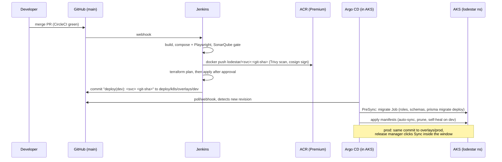

# GitOps delivery: Jenkins bumps tags, Argo CD syncs

```
deploy/
  k8s/
    base/                       one copy of every manifest
      namespace.yaml            lodestar, istio.io/rev=<asm revision>
      common/                   lodestar-common ConfigMap (OIDC, service URLs)
      policies/                 PriorityClasses, ResourceQuota, LimitRange
      services/<svc>/           Deployment, Service, ServiceAccount (workload identity),
                                SecretProviderClass (Key Vault), ConfigMap, PDB,
                                HPA or KEDA ScaledObject (agent, sync)
      istio/                    STRICT mTLS, RequestAuthentication (Entra JWKS),
                                deny-all + per-edge AuthorizationPolicies, Gateway,
                                VirtualServices (/odata/v4/<EntitySet> routing), DestinationRules
      ingress/                  Private Link Service for Front Door, TLS sync from Key Vault,
                                X-Azure-FDID lock (namespace aks-istio-ingress)
      network-policies/         Cilium-enforced defence in depth
      jobs/migrate.yaml         Argo CD PreSync hook: DB roles/schemas + prisma migrate (+ seed)
    components/azure-wiring/    kustomize replacements: fills TENANT_ID, CLIENT_ID_*, hosts, ...
    overlays/dev|prod/          replicas, images (ACR), autoscaling bounds, LOG_LEVEL, RUN_SEED
      azure-wiring/azure.env    non-secret IDs from `terraform output -raw kustomize_azure_env`
    overlays/local/             kind only (deploy/local/kind/up.sh), never synced by Argo CD
  argocd/
    bootstrap/root-app.yaml     root app-of-apps (Terraform installs the same via Helm)
    envs/dev/                   AppProject lodestar-dev + Application lodestar-dev (auto-sync)
    envs/prod/                  AppProject lodestar-prod (sync windows) + Application lodestar-prod (manual)
```

## Flow



1. **Root app.** Terraform (`infra/terraform/modules/argocd`) installs Argo CD and one root Application, `lodestar-root-<env>`, in the restricted `lodestar-bootstrap` project. The root app may only create `Application` and `AppProject` objects in the `argocd` namespace, from `deploy/argocd/envs/<env>`.
2. **Child app.** `envs/<env>` contains the environment's AppProject and its Application:
   - **dev** (`lodestar-dev`): `automated: {prune: true, selfHeal: true}`. Every tag bump rolls out without anyone clicking.
   - **prod** (`lodestar-prod`): no `automated` block, so syncs are manual. The project has a release window (Mon–Thu 10:00–16:00, Asia/Colombo) and a hard freeze from 04:00 to 08:00 daily for loading and dispatch.
3. **Project guardrails.** Each AppProject allows one repo, the namespaces `lodestar` and `aks-istio-ingress`, `Namespace` as the only cluster-scoped kind, and an explicit list of namespaced kinds. It cannot create Secrets, RBAC or CRDs.
4. **Migrations.** `base/jobs/migrate.yaml` is a PreSync hook, so the schema is migrated before any Deployment rolls. `RUN_SEED` is `true` on dev and `false` on prod.
5. **Replica drift.** HPAs own `spec.replicas`. The Applications ignore that field (`RespectIgnoreDifferences=true`).
6. **Scaling objects.** The AppProjects also allow `PriorityClass` (cluster-scoped), `ResourceQuota`, `LimitRange`, and KEDA's `ScaledObject` and `TriggerAuthentication`. The KEDA CRDs come from the AKS add-on, which Terraform enables. KEDA creates the HPAs for `agent` and `sync` itself. They are not in git, and Argo CD shows them as children of the ScaledObjects. See `deploy/k8s/README.md` and PLATFORM.md section 9.

## What Jenkins does (PLATFORM.md §7, step 6)

```bash
# after images are pushed and signed
ACR=$(terraform -chdir=infra/terraform/envs/dev output -raw acr_login_server)
cd deploy/k8s/overlays/dev
for svc in auth orders planning fleet outlets trips sync notifications audit agent frontend mobile-web migrate; do
  kustomize edit set image "lodestar/${svc}=${ACR}/lodestar/${svc}:${GIT_COMMIT}"
done
kustomize build . > /dev/null                      # guard: must render
git -c user.name=jenkins -c user.email=jenkins@lodestar commit -am "deploy(dev): ${GIT_COMMIT} [skip ci]"
git push origin HEAD:main
```

For prod, the same bump goes to `overlays/prod`, usually promoting the exact tag that passed on dev. Push it directly or through a PR. Argo CD shows prod `OutOfSync` until a release manager syncs.

Jenkins credentials (IDs as used in the Jenkinsfile):

| Credential ID | Type | Used for |
|---|---|---|
| `azure-sp-lodestar` | Azure service principal (or agent workload identity) | `az acr login`, Terraform (`ARM_*`), kubelogin `spn` |
| `github-gitops-push` | GitHub App / fine-grained PAT, contents:write on this repo | the tag-bump commit |
| `cosign-key` + `cosign-password` | secret file + secret text (or keyless with OIDC) | image signing |
| `sonarqube-token` | secret text | quality gate |
| `lodestar-tf-backend-dev`, `lodestar-tf-backend-prod` | secret file | `backend.hcl` |
| `lodestar-tfvars-dev`, `lodestar-tfvars-prod` | secret file | `terraform.tfvars` (IDs only) |
| `argocd-repo-token` | secret text, read-only | `TF_VAR_git_repo_password`, only if the repo is private |

The Jenkins service principal needs `AcrPush` on the registry (Terraform grants it via `ci_principal_object_id`), `Storage Blob Data Contributor` on the state account (bootstrap), and Owner or User Access Administrator plus Application Administrator for `terraform apply`.

## What Argo CD needs

- Repo `https://github.com/Adagard-Trios/Tech-Triathlon.git`, branch `main`. Paths: `deploy/argocd/envs/<env>` (root) and `deploy/k8s/overlays/<env>` (workloads).
- For a private repo, the secret `argocd/repo-lodestar` (label `argocd.argoproj.io/secret-type: repository`), created by Terraform from `TF_VAR_git_repo_password`.
- No registry credentials: nodes pull from ACR with the kubelet identity (`AcrPull`).
- No application secrets: pods read Key Vault through the CSI driver with their own workload identity.

## Wiring values

`overlays/<env>/azure-wiring/azure.env` ships with placeholder zero GUIDs. After `terraform apply`:

```bash
terraform -chdir=infra/terraform/envs/dev output -raw kustomize_azure_env \
  > deploy/k8s/overlays/dev/azure-wiring/azure.env
```

These are identifiers only: tenant ID, client IDs, vault name, hosts and CIDRs. The ConfigMap built from them is `local-config`, so it is never applied to the cluster.

## Local checks

```bash
kustomize build deploy/k8s/overlays/dev  | kubeconform -strict -ignore-missing-schemas -
kustomize build deploy/k8s/overlays/prod | kubeconform -strict -ignore-missing-schemas -
kustomize build --load-restrictor LoadRestrictionsNone deploy/k8s/overlays/local | kubeconform -strict -ignore-missing-schemas -
```

To run the whole platform on a local kind cluster, see `deploy/k8s/README.md` (`deploy/local/kind/up.sh`).
