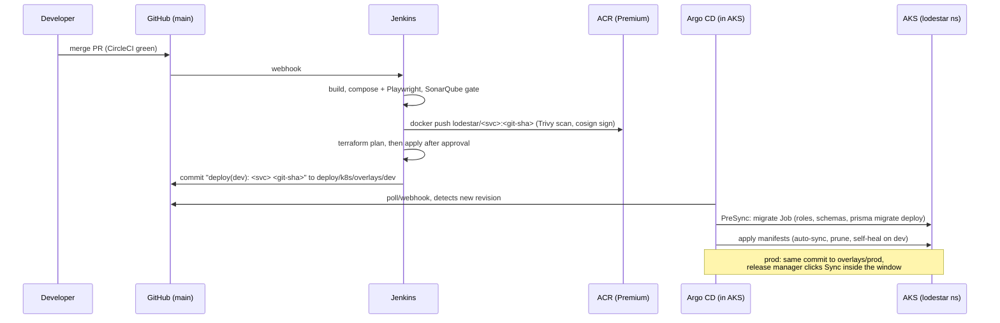

# GitOps delivery: CircleCI bumps tags, Argo CD syncs

> **What is live, and what is not.** The live delivery path is the **demo on one VM**: CircleCI pushes images to GHCR and commits the new tags to `deploy/k8s/overlays/demo`, and Argo CD on the VM's k3s syncs them ("Demo on k3s" below). Until the cut-over in step 7 has happened, the public URL is still served by the compose stack (`deploy/azure-demo`), and this path is built but not serving. The AKS part (`envs/dev`, `envs/prod`, `overlays/dev|prod`, Istio, Front Door, Key Vault, Terraform `envs/dev|prod`) is **target architecture that was not applied**; see [`infra/README.md`](../../infra/README.md). Jenkins (`Jenkinsfile`) is not on the live path; it is kept for reference only, with the AKS design below.

The repository URL is written once, in [`repo/kustomization.yaml`](repo/kustomization.yaml) (a kustomize component). Every Application and AppProject here says `REPO_URL` and gets the value at build time, so apply these folders with `kubectl apply -k`, never `-f`.

## Demo on k3s

```
GitHub main ──▶ CircleCI main: tests ─▶ 14 images → ghcr.io/adagard-trios/lodestar-<svc>:<sha>
                                     ─▶ gitops-bump: kustomize edit set image in deploy/k8s/overlays/demo, commit [skip ci]
Argo CD (k3s on the VM) polls main ──▶ Sync: Postgres, then the migrate Job (hook), then the services
ingress-nginx (80/443, hostNetwork) + cert-manager (Let's Encrypt) ──▶ gateway ──▶ /, /field/, /odata/v4/, /auth/, /ws/
```

What `deploy/k8s/overlays/demo` is: `overlays/local` (the kind setup: in-cluster Postgres, Redis and Keycloak, the NGINX gateway, no Azure workload identity, no Key Vault CSI, no Istio) plus, for plain k3s on one node:
- no KEDA (the agent and sync ScaledObjects go), no HPAs, one replica of everything, small requests;
- no Secret from git: every dev-only Secret of `overlays/local` is deleted, and the real ones are created on the VM from its `.env` by [`deploy/azure-demo/k3s-secrets.sh`](../azure-demo/k3s-secrets.sh);
- the migrate + seed Job runs as an Argo CD Sync hook, reads the competition CSVs from the ConfigMap `lodestar-data` (created on the VM by the same script; optional) and `DEMO_DATE` from the overlay;
- Keycloak in production mode, as in `compose.prod.yml`;
- an Ingress with a Let's Encrypt certificate in front of the gateway; the host name is in `overlays/demo/platform/host.env` only;
- image tags in `overlays/demo/kustomization.yaml`, the only file CI rewrites.

Render it without a cluster:

```bash
kubectl kustomize --load-restrictor LoadRestrictionsNone deploy/k8s/overlays/demo
```

### 0. The VM

k3s and the compose stack do not both fit in the default `Standard_B2als_v2` (4 GiB). For the GitOps path use **`Standard_B2ms`** (2 vCPU, 8 GiB) with **`install_k3s = true`** in `infra/terraform/envs/demo/terraform.tfvars`.

- **New VM:** set both, then `terraform plan` / `apply` as in [`deploy/azure-demo/README.md`](../azure-demo/README.md). cloud-init installs k3s without Traefik and without its service load balancer, so nothing in k3s takes 80/443.
- **The VM already serving the compose demo:** `install_k3s` changes the VM's cloud-init (`custom_data`), and Terraform then **replaces** the VM (new disk; the compose data and `.env` are gone). Change only `vm_size = "Standard_B2ms"`, check that `terraform plan` says *update in-place* (the VM reboots once; compose comes back by itself), then install k3s by hand with the same line cloud-init uses:

  ```bash
  ssh lodestar@<fqdn>
  curl -sfL https://get.k3s.io | sudo INSTALL_K3S_EXEC="--disable=traefik --disable=servicelb --write-kubeconfig-mode=600" sh -
  ```

The steps below run **on the VM** (`ssh lodestar@<fqdn>`), from `/opt/lodestar`. They need no Azure login; the GitHub and GHCR tokens in steps 4 and 5 are only needed if the repo or the packages are private.

### 1. kubectl and helm

```bash
mkdir -p ~/.kube && sudo cp /etc/rancher/k3s/k3s.yaml ~/.kube/config && sudo chown "$USER" ~/.kube/config && chmod 600 ~/.kube/config
kubectl get nodes                                   # one node, Ready
curl -fsSL https://raw.githubusercontent.com/helm/helm/main/scripts/get-helm-3 | bash
cd /opt/lodestar && git remote set-url origin https://github.com/Adagard-Trios/Lodestar.git && git pull
```

### 2. cert-manager and the Let's Encrypt issuers

```bash
helm repo add jetstack https://charts.jetstack.io && helm repo update
helm upgrade --install cert-manager jetstack/cert-manager -n cert-manager --create-namespace --set crds.enabled=true --wait
kubectl apply -f - <<'EOF'
apiVersion: cert-manager.io/v1
kind: ClusterIssuer
metadata:
  name: letsencrypt
spec:
  acme:
    server: https://acme-v02.api.letsencrypt.org/directory
    email: you@example.com                 # the ACME_EMAIL of .env
    privateKeySecretRef: { name: letsencrypt-account }
    solvers:
      - http01: { ingress: { ingressClassName: nginx } }
---
apiVersion: cert-manager.io/v1
kind: ClusterIssuer
metadata:
  name: letsencrypt-staging                # for trials: no rate limit, untrusted certificate
spec:
  acme:
    server: https://acme-staging-v02.api.letsencrypt.org/directory
    email: you@example.com
    privateKeySecretRef: { name: letsencrypt-staging-account }
    solvers:
      - http01: { ingress: { ingressClassName: nginx } }
EOF
```

The Ingress uses `letsencrypt`. Caddy has already been issued certificates for the same name, and Let's Encrypt allows 5 duplicate certificates per name per week. The certificate Secret `lodestar-tls` survives switching back and forth, so cert-manager only asks once.

### 3. Argo CD

```bash
kubectl create namespace argocd
kubectl apply -n argocd --server-side --force-conflicts \
  -f https://raw.githubusercontent.com/argoproj/argo-cd/stable/manifests/install.yaml
# overlays/demo (through overlays/local) reads the realm and the Postgres init script from outside its folder
kubectl -n argocd patch configmap argocd-cm --type merge \
  -p '{"data":{"kustomize.buildOptions":"--load-restrictor LoadRestrictionsNone"}}'
kubectl -n argocd rollout restart deploy/argocd-repo-server
kubectl -n argocd rollout status deploy/argocd-repo-server
kubectl -n argocd get secret argocd-initial-admin-secret -o jsonpath='{.data.password}' | base64 -d; echo
# UI from your laptop: ssh -L 8081:localhost:8081 lodestar@<fqdn>, then on the VM
#   kubectl -n argocd port-forward svc/argocd-server 8081:443     and open https://localhost:8081 (user admin)
```

### 4. Registry and repository access (only if private)

- **GHCR images.** Either make the 14 `lodestar-*` packages public (GitHub → the org's Packages → each package → Package settings → Change visibility), or give k3s a read token:

  ```bash
  sudo tee /etc/rancher/k3s/registries.yaml >/dev/null <<'EOF'
  configs:
    ghcr.io:
      auth: { username: <github user>, password: <token with read:packages> }
  EOF
  sudo systemctl restart k3s
  ```

- **The Git repo.** Public: nothing to do. Private:

  ```bash
  kubectl -n argocd create secret generic repo-lodestar \
    --from-literal=type=git --from-literal=url=https://github.com/Adagard-Trios/Lodestar.git \
    --from-literal=username=<github user> --from-literal=password=<fine-grained token, contents:read>
  kubectl -n argocd label secret repo-lodestar argocd.argoproj.io/secret-type=repository
  ```

### 5. Secrets and the CSV ConfigMap (never in git)

```bash
cd /opt/lodestar
# optional: the competition CSVs, copied by hand from your laptop:  scp data/*.csv lodestar@<fqdn>:/opt/lodestar/data/
bash deploy/azure-demo/k3s-secrets.sh
kubectl -n lodestar get secrets,configmaps
```

The script reads the VM's `.env` (written by `make-env.sh` for compose), so Postgres, Keycloak, the service clients and the personas get the same passwords on both sides. It creates `postgres-credentials`, `redis-credentials`, `identity-secrets`, `<service>-secrets` for the ten services, and `lodestar-data` from `data/*.csv`.

### 6. The demo application

CI must have pushed images at least once: `grep newTag deploy/k8s/overlays/demo/kustomization.yaml | sort -u` must show a commit SHA, not `pending-first-ci-run` (`git pull` first). Then:

```bash
kubectl apply -k deploy/argocd/envs/demo
kubectl -n argocd get application lodestar-demo -w        # Synced, then Healthy (the first Keycloak start takes a few minutes)
kubectl -n lodestar get pods,jobs
kubectl -n lodestar logs job/migrate                      # migrations, then the seed (CSV or synthetic)
```

While compose still owns 80/443 the Ingress has no controller yet and stays *Progressing*; everything behind it can be checked through a port-forward:

```bash
kubectl -n lodestar port-forward svc/gateway 9443:8443 &
curl -sk https://localhost:9443/version; echo             # the SHA in overlays/demo
curl -sk -H "Host: <fqdn>" https://localhost:9443/auth/realms/lodestar/.well-known/openid-configuration | jq -r .issuer
kill %1
```

**A pushed change reaching the cluster** (the first half of the cut-over rule): push any commit to `main`; when CircleCI's `gitops-bump` has committed `deploy: demo → <sha> [skip ci]`, Argo CD syncs within 3 minutes. `kubectl -n lodestar get deploy gateway -o jsonpath='{.spec.template.spec.containers[0].image}'` and the `/version` call above then show the new SHA. (`argocd app get` or the UI show the same.)

Memory while preparing: compose (~1.5–2 GB) and the k3s side (~3 GB with Argo CD and cert-manager) fit together in 8 GiB, but only just on 2 vCPUs. If pods stay `Pending` or are OOM-killed, cut over earlier rather than resizing again.

### 7. Cut-over: who owns 80/443

Only one of compose (Caddy) or k3s (ingress-nginx) listens on 80/443. ingress-nginx runs with `hostNetwork`, so it binds 80/443 (and 8443 for its admission webhook, 10254 for health) whenever k3s runs. Hence the rule, from the moment ingress-nginx is installed: **k3s runs only when compose is down.**

**Compose → k3s** (cut-over; first time, ingress-nginx is installed here):

```bash
cd /opt/lodestar
bash deploy/azure-demo/up.sh down                          # Caddy releases 80/443; the compose volumes stay
sudo systemctl enable --now k3s                            # no-op if it is already running
helm repo add ingress-nginx https://kubernetes.github.io/ingress-nginx && helm repo update
helm upgrade --install ingress-nginx ingress-nginx/ingress-nginx -n ingress-nginx --create-namespace \
  --set controller.kind=DaemonSet --set controller.hostNetwork=true --set controller.dnsPolicy=ClusterFirstWithHostNet \
  --set controller.service.type=ClusterIP --set controller.publishService.enabled=false \
  --set controller.reportNodeInternalIp=true --set controller.ingressClassResource.default=true --wait
kubectl -n lodestar get certificate lodestar-tls -w        # READY True within a minute or two (HTTP-01 on port 80)
curl -fsS https://<fqdn>/version; echo                     # the SHA Argo CD deployed
```

If the certificate is not ready after five minutes: `kubectl -n lodestar describe challenges`. Before cert-manager asks Let's Encrypt, it fetches the challenge URL over the VM's own public IP. A challenge left waiting from step 6, when Caddy still held port 80, gets picked up again by itself. If the reason shown is anything else, `kubectl -n lodestar delete certificate lodestar-tls` re-creates the certificate from the Ingress.

Then sign in as the four roles from a phone-sized browser (README accounts; driver and loader at `/field/`). If any role fails, switch back at once (below) and keep compose as the live path. Once it holds, set the CircleCI pipeline parameter `public-url` to `https://<fqdn>` so `smoke-public` checks every deploy.

ingress-nginx is retired upstream (best-effort maintenance ended in March 2026; no new releases). Its last release is fine for a demo. On a longer-lived cluster, re-enable k3s's Traefik instead and move the Ingress annotations over.

**k3s → compose** (rollback; also frees the k3s memory):

```bash
cd /opt/lodestar
sudo systemctl disable --now k3s && sudo /usr/local/bin/k3s-killall.sh   # stops every pod; 80/443 are free
bash deploy/azure-demo/up.sh
```

`disable` matters: a VM reboot would otherwise start k3s next to compose, and both would race for 80/443. Going back to k3s later is the first two commands of the cut-over (`up.sh down`, `systemctl enable --now k3s`); ingress-nginx, Argo CD, the certificate and the Postgres volume are all still there.

The two sides keep separate databases (the compose volume `lodestar_pgdata`, the k3s volume `data-postgres-0`). Each seeds the demo day itself, so orders placed on one side are not on the other.

### Day to day

- Every green `main` build deploys itself: images, tag bump, Argo CD sync, smoke test (once `public-url` is set).
- Config change (host, `DEMO_DATE`, resources): commit to `overlays/demo/platform`; ConfigMaps keep their names, so restart what reads them: `kubectl -n lodestar rollout restart deploy`.
- Status: `kubectl -n argocd get applications`, `kubectl -n lodestar get pods`.

## Target architecture: AKS (not applied)

Everything below is the design for a production rollout on AKS (Istio, Front Door, Key Vault, ACR), with Jenkins as its pipeline. None of it is deployed.

```
deploy/
  k8s/
    base/                       one copy of every manifest
      namespace.yaml            lodestar, istio.io/rev=<asm revision>
      common/                   lodestar-common ConfigMap (OIDC, service URLs)
      policies/                 PriorityClasses, ResourceQuota, LimitRange
      services/<svc>/           Deployment, Service, ServiceAccount (workload identity),
                                SecretProviderClass (Key Vault), ConfigMap, PDB,
                                HPA or KEDA ScaledObject (agent, sync)
      istio/                    STRICT mTLS, RequestAuthentication (Entra JWKS),
                                deny-all + per-edge AuthorizationPolicies, Gateway,
                                VirtualServices (/odata/v4/<EntitySet> routing), DestinationRules
      ingress/                  Private Link Service for Front Door, TLS sync from Key Vault,
                                X-Azure-FDID lock (namespace aks-istio-ingress)
      network-policies/         Cilium-enforced defence in depth
      jobs/migrate.yaml         Argo CD PreSync hook: DB roles/schemas + prisma migrate (+ seed)
    components/azure-wiring/    kustomize replacements: fills TENANT_ID, CLIENT_ID_*, hosts, ...
    overlays/dev|prod/          replicas, images (ACR), autoscaling bounds, LOG_LEVEL, RUN_SEED
      azure-wiring/azure.env    non-secret IDs from `terraform output -raw kustomize_azure_env`
    overlays/local/             kind only (deploy/local/kind/up.sh), never synced by Argo CD
    overlays/demo/              the demo VM's k3s (the live GitOps path): overlays/local + k3s changes
  argocd/
    repo/                       the one place the repo URL is written (kustomize component)
    bootstrap/root-app.yaml     root app-of-apps (Terraform installs the same via Helm)
    envs/dev/                   AppProject lodestar-dev + Application lodestar-dev (auto-sync)
    envs/prod/                  AppProject lodestar-prod (sync windows) + Application lodestar-prod (manual)
    envs/demo/                  AppProject lodestar-demo + Application lodestar-demo (auto-sync, prune, self-heal)
```

### Flow (AKS)



1. **Root app.** Terraform (`infra/terraform/modules/argocd`) installs Argo CD and one root Application, `lodestar-root-<env>`, in the restricted `lodestar-bootstrap` project. The root app may only create `Application` and `AppProject` objects in the `argocd` namespace, from `deploy/argocd/envs/<env>`.
2. **Child app.** `envs/<env>` contains the environment's AppProject and its Application:
   - **dev** (`lodestar-dev`): `automated: {prune: true, selfHeal: true}`. Every tag bump rolls out without anyone clicking.
   - **prod** (`lodestar-prod`): no `automated` block, so syncs are manual. The project has a release window (Mon–Thu 10:00–16:00, Asia/Colombo) and a hard freeze from 04:00 to 08:00 daily for loading and dispatch.
3. **Project guardrails.** Each AppProject allows one repo, the namespaces `lodestar` and `aks-istio-ingress`, `Namespace` as the only cluster-scoped kind, and an explicit list of namespaced kinds. It cannot create Secrets, RBAC or CRDs.
4. **Migrations.** `base/jobs/migrate.yaml` is a PreSync hook, so the schema is migrated before any Deployment rolls. `RUN_SEED` is `true` on dev and `false` on prod.
5. **Replica drift.** HPAs own `spec.replicas`. The Applications ignore that field (`RespectIgnoreDifferences=true`).
6. **Scaling objects.** The AppProjects also allow `PriorityClass` (cluster-scoped), `ResourceQuota`, `LimitRange`, and KEDA's `ScaledObject` and `TriggerAuthentication`. The KEDA CRDs come from the AKS add-on, which Terraform enables. KEDA creates the HPAs for `agent` and `sync` itself. They are not in git, and Argo CD shows them as children of the ScaledObjects. See `deploy/k8s/README.md` and PLATFORM.md section 9.

### What Jenkins would do (PLATFORM.md §7, step 6; reference only)

```bash
# after images are pushed and signed
ACR=$(terraform -chdir=infra/terraform/envs/dev output -raw acr_login_server)
cd deploy/k8s/overlays/dev
for svc in auth orders planning fleet outlets trips sync notifications audit agent frontend mobile-web migrate; do
  kustomize edit set image "lodestar/${svc}=${ACR}/lodestar/${svc}:${GIT_COMMIT}"
done
kustomize build . > /dev/null                      # guard: must render
git -c user.name=jenkins -c user.email=jenkins@lodestar commit -am "deploy(dev): ${GIT_COMMIT} [skip ci]"
git push origin HEAD:main
```

For prod, the same bump goes to `overlays/prod`, usually promoting the exact tag that passed on dev. Push it directly or through a PR. Argo CD shows prod `OutOfSync` until a release manager syncs.

Jenkins credentials (IDs as used in the Jenkinsfile):

| Credential ID | Type | Used for |
|---|---|---|
| `azure-sp-lodestar` | Azure service principal (or agent workload identity) | `az acr login`, Terraform (`ARM_*`), kubelogin `spn` |
| `github-gitops-push` | GitHub App / fine-grained PAT, contents:write on this repo | the tag-bump commit |
| `cosign-key` + `cosign-password` | secret file + secret text (or keyless with OIDC) | image signing |
| `sonarqube-token` | secret text | quality gate |
| `lodestar-tf-backend-dev`, `lodestar-tf-backend-prod` | secret file | `backend.hcl` |
| `lodestar-tfvars-dev`, `lodestar-tfvars-prod` | secret file | `terraform.tfvars` (IDs only) |
| `argocd-repo-token` | secret text, read-only | `TF_VAR_git_repo_password`, only if the repo is private |

The Jenkins service principal needs `AcrPush` on the registry (Terraform grants it via `ci_principal_object_id`), `Storage Blob Data Contributor` on the state account (bootstrap), and Owner or User Access Administrator plus Application Administrator for `terraform apply`.

### What Argo CD needs (AKS)

- Repo `https://github.com/Adagard-Trios/Lodestar.git` (set once in `deploy/argocd/repo`), branch `main`. Paths: `deploy/argocd/envs/<env>` (root) and `deploy/k8s/overlays/<env>` (workloads).
- For a private repo, the secret `argocd/repo-lodestar` (label `argocd.argoproj.io/secret-type: repository`), created by Terraform from `TF_VAR_git_repo_password`.
- No registry credentials: nodes pull from ACR with the kubelet identity (`AcrPull`).
- No application secrets: pods read Key Vault through the CSI driver with their own workload identity.

### Wiring values

`overlays/<env>/azure-wiring/azure.env` ships with placeholder zero GUIDs. After `terraform apply`:

```bash
terraform -chdir=infra/terraform/envs/dev output -raw kustomize_azure_env \
  > deploy/k8s/overlays/dev/azure-wiring/azure.env
```

These are identifiers only: tenant ID, client IDs, vault name, hosts and CIDRs. The ConfigMap built from them is `local-config`, so it is never applied to the cluster.

### Local checks

```bash
kustomize build deploy/k8s/overlays/dev  | kubeconform -strict -ignore-missing-schemas -
kustomize build deploy/k8s/overlays/prod | kubeconform -strict -ignore-missing-schemas -
kustomize build --load-restrictor LoadRestrictionsNone deploy/k8s/overlays/local | kubeconform -strict -ignore-missing-schemas -
kustomize build --load-restrictor LoadRestrictionsNone deploy/k8s/overlays/demo  | kubeconform -strict -ignore-missing-schemas -
for d in bootstrap envs/dev envs/prod envs/demo; do kustomize build deploy/argocd/$d > /dev/null; done
```

To run the whole platform on a local kind cluster, see `deploy/k8s/README.md` (`deploy/local/kind/up.sh`).
