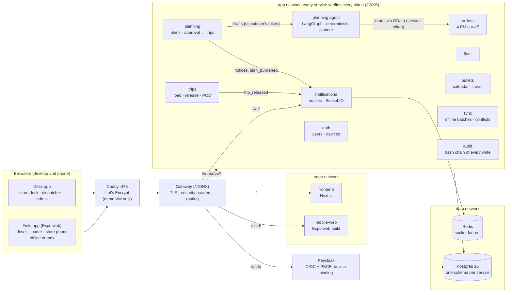
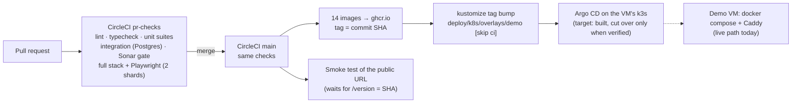

# Architecture

The detailed design (zero trust, OData conventions, offline sync, the planning agent) is in [architecture/PLATFORM.md](architecture/PLATFORM.md). The data model is in [data-model.md](data-model.md). Images: [architecture.svg](architecture.svg), [delivery.svg](delivery.svg), [data-model.svg](data-model.svg).

The images are exported from the Mermaid source on these pages with mermaid-cli, for example `npx @mermaid-js/mermaid-cli -i architecture.mmd -o docs/architecture.svg -b white`. `node tools/docs/erd.mjs` regenerates `data-model.md` from `schema.prisma`, and `--check` fails when it is out of date.

## Runtime: one origin, four roles

Every face is served from one origin. The public demo runs the same `docker compose` stack on one Azure VM behind Caddy ([deploy/azure-demo](../deploy/azure-demo/README.md)); a laptop runs it without Caddy on `https://localhost:8443`.

| Path | Goes to |
|---|---|
| `/` | Desk app and the start page (pick a role) |
| `/field/` | Field app for driver, loader and the store phone |
| `/odata/v4/<EntitySet>` | The service that owns the entity set (OData v4) |
| `/auth/` | Keycloak (sign-in, tokens) |
| `/ws/` | Realtime events (Socket.IO) |

## Delivery: from a pull request to the demo

What is applied and what is target architecture is listed in [infra/README.md](../infra/README.md).
