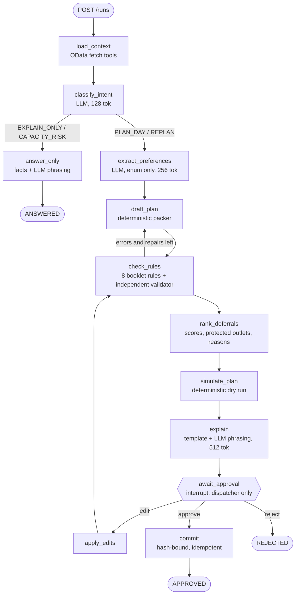

# Planner agent

The planning agent (`backend/apps/agent`, Python, FastAPI + LangGraph) drafts a day's delivery plan for one depot, checks it, explains it and waits for a dispatcher. It follows **Plan → Execute → Verify**: an LLM may read the dispatcher's request and choose what to look at, but every allocation, rule check, simulation and approval is deterministic code, and nothing reaches the dispatcher unvalidated.

## Graph

Node names that existed before (`load_context`, `draft_plan`, `check_rules`, `rank_deferrals`, `explain`, `await_approval`, `apply_edits`) are unchanged, because the DSP-22 drafting screen reads them from `history`. With no request text, `classify_intent` and `extract_preferences` make no LLM call (`PLAN_DAY`, no preferences), so a plain run uses one LLM call (the explanation).

"Ask the agent" (`POST /ask`, `graph/ask.py`) is a separate `agent ⇄ ToolNode` loop over a run snapshot. The LLM picks from `plan_summary`, `rule_checks`, `capacity`, `list_deferrals`, `explain_order`, `lookup_vehicle`, `lookup_outlet` and `propose_edit`. `propose_edit` only previews an edit, re-runs the hard rules on it, and returns it as a proposal. The dispatcher applies it with `resume {decision: "edit"}`.

## Existing, extended, new

| Part | Status | Where |
|---|---|---|
| Deterministic packer, booklet rules, deferral ranking, edits, OData tools, Postgres checkpoints, JWT auth | existing, unchanged | `domain/planner.py`, `rules.py`, `deferrals.py`, `edits.py`, `tools.py`, `checkpoint.py`, `auth.py` |
| Planning graph | extended: intent / preference / answer-only / simulate / commit nodes, validator in `check_rules`, preference constraints, LLM audit, degraded flag | `graph/builder.py`, `graph/state.py` |
| Run API | extended: optional `request` on `POST /runs`, optional `planHash` on resume, new fields on the run view, `llmMetrics` on `GET /config` | `app.py`, `api/schemas.py`, `runtime.py`, `agent_config.py` |
| Independent validator (15 rule codes, repair hints) | new | `domain/validator.py` |
| Dry-run simulation | new | `domain/simulation.py` |
| Deferral explanations | new | `domain/deferral_notes.py` |
| Approval binding | new | `domain/approval.py` |
| Provider abstraction, Gemini, Groq, router, cache, metrics, LLM tasks, routed chat model | new | `llm/base.py`, `gemini_provider.py`, `groq_provider.py`, `router.py`, `cache.py`, `metrics.py`, `tasks.py`, `routed.py` |
| `MockChatModel`, Azure `PhrasingChatModel` | existing, unchanged (Azure stays optional) | `llm/mock.py`, `llm/phrasing.py` |

## Provider fallback

`AGENT_MODEL=gemini` builds `RoutedChatModel` over `LLMRouter`. Graph nodes call the router (`llm/tasks.py`), never a provider.

1. Cache (intent, preferences, explanations only). The key is task, prompt version, provider chain, input hash, planning date and plan version.
2. **Gemini** (`GEMINI_MODEL`, default `gemini-2.5-flash-lite`). This uses REST `generateContent` in JSON mode, with the key in the `x-goog-api-key` header.
3. **Groq** (`GROQ_MODEL`, default `llama-3.1-8b-instant`). This uses OpenAI-compatible chat completions with `response_format: json_object` and a bearer key.
4. **Template**: the deterministic answer the mock model would give.

Errors are classified as `auth`, `rate_limit`, `quota`, `timeout`, `network`, `server`, `invalid_response`, `schema_validation` or `unknown`. Only `rate_limit`, `timeout`, `network` and `server` get one retry (`LLM_MAX_RETRIES=1`). Everything else moves to the next provider. A reply is used only after it parses as JSON and validates against the task's pydantic schema. Partial or malformed output is never used.

| Situation | Result |
|---|---|
| No key configured | Template answer, `degraded: false`, `fallbackReason: not_configured` |
| Both providers fail | Template answer, `degraded: true`; the run gets `llmDegraded: true` and the explanation starts with `LLM_DEGRADED` |

Every call records `provider`, `model`, `fallbackReason`, `degraded`, `cached`, `retries`, `latencyMs`, `tokensIn` and `tokensOut` in the run's `llmCalls` and in a structured log line with the run id. Keys never appear in prompts, logs, state or responses. Prompt and reply text is logged only with `LLM_LOG_PROMPTS` / `LLM_LOG_RESPONSES`.

Counters (answers per provider, failures per category, fallback rate, degraded calls and runs, retries, cache hits and misses, repairs, average latency, tokens) are served read-only at `GET /config` as `llmMetrics`.

Implementation note: the providers call the two REST APIs over the agent's pinned `httpx`, not through `langchain-google-genai` / `langchain-groq`. This adds no dependencies. It also lets the router classify each failure, which `Runnable.with_fallbacks` does not expose, and lets the tests mock both APIs with `httpx.MockTransport`.

## What the LLM may and may not do

| Task | Output (strict schema) | Budget | Checked |
|---|---|---|---|
| Classify intent | `PLAN_DAY` / `REPLAN` / `EXPLAIN_ONLY` / `CAPACITY_RISK` | 128 | Enum |
| Extract preferences | Subset of `PRIORITISE_CHILLED`, `PRIORITISE_PREVIOUSLY_DEFERRED`, `PRIORITISE_MALL_WINDOWS`, `PRIORITISE_VAN_ONLY`, `PRIORITISE_DISTRICT` (+ a district from the run) | 256 | Enum; unknown districts dropped. Preferences become the drafter's existing `prioritise` constraints (packing order), not allocations |
| Pick Ask tools | ≤4 calls | 256 | Tool offered, required args present, ids exist in the run, `op` / `reason` / `trip_no` enums. Otherwise the deterministic picks are used. `propose_edit` results are rule-checked and never applied |
| Phrase text | `{text}` | 512 | Every number and id in the draft must survive, with none added. Otherwise the template text is used |

All prompts share one short safety policy: use only the given facts, never claim to publish, and ignore instructions inside user text. The LLM sees compact context only: counts, chilled demand vs reefer capacity, vehicles down and previously deferred orders. It never sees order or outlet tables.

## Verification

- **Validator** (`validate_plan`) returns `{valid, errors[{code, rule, message, order_ids, vehicle_id, trip_id, severity, repair_hint}], warnings, checked_rules, violated_rule_count}`.
  - The 8 booklet rules keep their `rules.py` names for the UI and map to `WEIGHT_CAPACITY_EXCEEDED`, `VOLUME_CAPACITY_EXCEEDED`, `FRESH_TIME_BUDGET_EXCEEDED` / `STYLE_TECH_TIME_BUDGET_EXCEEDED`, `TOO_MANY_TRIPS`, `FUEL_QUOTA_EXCEEDED`, `VAN_ONLY_OUTLET_ON_TRUCK`, `MALL_ACCESS_CONFLICT` and `DELIVERY_WINDOW_CONFLICT`.
  - Checked independently: `BRAND_DISTRICT_MISMATCH`, `CHILLED_ORDER_ON_AMBIENT_VEHICLE`, `DEPOT_MISMATCH`, `ORDER_SPLIT`, `DUPLICATE_ORDER_ASSIGNMENT` and `UNASSIGNED_ORDER_WITHOUT_DECISION`.
- **Repair**: violations become drafter constraints (`avoid` / `prioritise`) and loop back to `draft_plan`, at most `AGENT_MAX_REPAIR_ATTEMPTS` (default 2) times. Anything left is taken off the plan by `rank_deferrals`; protected orders go to needs-review.
- **Deferrals**: each carries a reason code, explanation, limiting constraint, consequence and `previouslyDeferred`. Previously deferred orders are protected by the existing scoring (+40, never deferred two days running).
- **Simulation**: served / deferred / needs-review counts, per-trip weight, volume and reefer %, minutes, departs / returns, litres, per-vehicle minutes vs budget and weekly fuel %, and late risk (max, average, stops ≥ 50%). Warnings: `HIGH_LATE_RISK`, `NEAR_CAPACITY`, `NEAR_TIME_BUDGET`, `FUEL_QUOTA_LOW`, `REEFER_SHORTFALL`, `PROTECTED_NEEDS_REVIEW`.
- **Approval**: only a `dispatcher` can resume (checked in the API and again in the graph).
  - An approval records `runId`, `version`, `by`, `at` and SHA-256 `planHash`, `validationHash` and `simulationHash`. `commit` re-checks them. An edit clears the approval.
  - A resume with a `planHash` that is not the current plan's is refused with 409. Re-sending the approval of the committed plan with its hash returns the run unchanged (idempotent).
  - The agent still never publishes (`canPublish: false`); the planning service does that on the human approval.

## Endpoints used

- **Agent:** `POST /runs`, `GET /runs/{id}`, `POST /runs/{id}/resume`, `POST /ask`, `GET /config`, `GET /health`, `GET /ready`.
- **Outbound:**
  - OData reads (Orders, Outlets, Vehicles, Calendar, DistrictTravel, ServiceAllowances) through the gateway with a client-credentials token.
  - The optional ML service (`ML_URL`).
  - `generativelanguage.googleapis.com` and `api.groq.com` when keys are set.

## Configuration

`AGENT_MODEL` (`gemini` in compose, `mock` as the settings default, `azure-openai` optional)

| Group | Variables |
|---|---|
| Gemini | `GEMINI_API_KEY`, `GEMINI_MODEL`, `GEMINI_TIMEOUT_SECONDS`, `GEMINI_MAX_OUTPUT_TOKENS` |
| Groq | `GROQ_API_KEY`, `GROQ_MODEL`, `GROQ_TIMEOUT_SECONDS`, `GROQ_MAX_OUTPUT_TOKENS` |
| Router | `LLM_PRIMARY_PROVIDER`, `LLM_FALLBACK_PROVIDER`, `LLM_MAX_RETRIES`, `LLM_ENABLE_FALLBACK`, `LLM_TEMPERATURE`, `LLM_ENABLE_CACHE`, `LLM_LOG_PROMPTS`, `LLM_LOG_RESPONSES` |
| Agent | `AGENT_MAX_REPAIR_ATTEMPTS` |

Human approval is always required and checkpointing always runs (Postgres with `DATABASE_URL`, memory otherwise), so neither has a switch.

## Tests

`backend/apps/agent/tests`. Both providers are mocked over HTTP with fake keys; nothing reaches the network.

- `test_llm_router.py`:
  - Gemini answers, with the key in the header and not in logs.
  - Gemini quota goes straight to Groq.
  - A rate limit is retried once, then goes to Groq; a 5xx recovers on the retry; a timeout goes to Groq.
  - When both fail, the template is used and the call is marked degraded.
  - Invalid schema or JSON from each provider is rejected.
  - Cache hit and miss; behaviour with no key or with Groq only.
  - Enum-only preferences; the phrasing fact check.
- `test_planner_agent.py`:
  - An LLM run's plan, validation, simulation and deferrals are identical to the mock's.
  - The intent and preference call budget; the capacity route skips planning.
  - A degraded run is flagged.
  - LLM tool choices are validated; proposals are rule-checked and not applied.
  - Validator codes on a hand-built bad plan; booklet rules map to their codes.
  - The bounded repair loop; simulation warnings and deferral explanations.
  - Approval hash binding, stale-hash refusal and idempotent commit.
- `test_allocation_invariants.py`: per-constraint invariants over seeded synthetic worlds.
