# Data model

Generated from [`backend/prisma/schema.prisma`](../backend/prisma/schema.prisma) by `node tools/docs/erd.mjs`; do not edit by hand. Image: [data-model.svg](data-model.svg).

One Postgres database with one schema per service; a service reads and writes only its own schema, and other services' data through their OData APIs.

| Schema (owning service) | Tables |
|---|---|
| `auth` | User, Device |
| `outlets` | Depot, Outlet, Calendar, DistrictTravel, DataImport, ServiceAllowance |
| `fleet` | Vehicle |
| `orders` | Order, OrderLineItem, OrdersIdempotencyKey, OrderClosure |
| `trips` | Trip, TripStop, POD, PodPhoto, LoadRecord, TripsIdempotencyKey |
| `sync` | OfflineEvent |
| `planning` | DeferralLog, Plan, AgentRun, DemandForecast |
| `notifications` | Notification |
| `audit` | AuditEntry |

`PK` primary key · `UK` unique · `FK` foreign key. Enum-typed columns show the enum name.

```mermaid
erDiagram
  User {
    string id PK
    string email UK
    string name
    string passwordHash
    Role role
    string depot
    string outletId FK
    string vehicleId
    string phone
    string refreshToken
    bool isActive
    json preferences
    datetime createdAt
    datetime updatedAt
  }
  Depot {
    string code PK
    string name
    string address
    string district
    float lat
    float lng
    string phone
    bool isActive
    datetime createdAt
    datetime updatedAt
  }
  Outlet {
    string id PK
    string name
    Brand brand
    string district
    string depot FK
    DockType dockType
    ParkingType parking
    string windowOpen
    string windowClose
    string mallWindow
    string address
    string accessNote
    float lat
    float lng
    bool isActive
    datetime updatedAt
  }
  Vehicle {
    string id PK
    string depot
    VehicleType type
    TempClass tempClass
    float capacityKg
    float capacityM3
    float kmPerLitre
    int weeklyLFuel
    int usedLThisWeek
    datetime fuelWeekStart
    VehicleStatus status
    string workshopNote
    datetime updatedAt
  }
  Order {
    string id PK
    string outletId FK
    datetime runDate
    datetime orderedAt
    Brand brand
    TempClass tempClass
    int units
    float kg
    float m3
    OrderStatus status
    bool deferredYesterday
    int daysSince
    int deferralScore
    string notes
    bool latePhone
    string lateReason
    datetime createdAt
    datetime updatedAt
    int unitsReceived
    int unitsExpected
    string receiptNote
    datetime receiptSavedAt
    datetime receivedAt
    string receivedBy
    string creditNoteId UK
  }
  OrderLineItem {
    string id PK
    string orderId FK
    string name
    int qty
    float kg
    TempClass tempClass
    datetime updatedAt
  }
  Trip {
    string id PK
    string vehicleId FK
    string driverId FK
    string depot
    datetime runDate
    Brand brand
    string district
    TripStatus status
    int planVersion
    int tripNumber
    datetime departTime
    datetime returnTime
    int planMinutes
    int actualMinutes
    string sealNumber
    float reeferTempC
    string bay
    string planId FK
    datetime createdAt
    datetime updatedAt
  }
  TripStop {
    string id PK
    string tripId FK
    string orderId UK,FK
    string outletId FK
    int stopSeq
    datetime etaPlan
    datetime etaModel
    datetime etaModelBandEarly
    datetime etaModelBandLate
    int lateRiskPct
    int serviceMinPredicted
    datetime arrivalActual
    datetime leaveActual
    OrderStatus status
    datetime updatedAt
  }
  POD {
    string id PK
    string tripStopId UK,FK
    int unitsDelivered
    int unitsOrdered
    string photoUrl
    string receiverName
    string signature
    json exceptions
    string creditNoteId
    bool savedOffline
    datetime savedAt
    datetime syncedAt
    datetime createdAt
    int photoCount
    string signatureUrl
    datetime signedAt
  }
  PodPhoto {
    string id PK
    string tripStopId FK
    string podId FK
    string kind
    string mime
    Bytes bytes
    int size
    string sha256
    string eventId UK
    datetime takenAt
    string uploadedBy
    datetime createdAt
  }
  LoadRecord {
    string id PK
    string tripId UK,FK
    string vehicleId FK
    string loaderId FK
    string bay
    string sealNumber
    float reeferTempC
    datetime loadedAt
    datetime releasedAt
    json shortfalls
    string notes
    datetime updatedAt
  }
  OfflineEvent {
    string id PK
    string driverId FK
    string tripId FK
    string eventType
    json payload
    datetime savedAt
    datetime syncedAt
    bool conflictResolved
    string conflictNote
  }
  DeferralLog {
    string id PK
    string orderId UK,FK
    DeferralReason reason
    int score
    string resolvedBy
    string notes
    datetime rescheduledDate
    bool isProvisional
    DeferralStatus status
    datetime confirmedAt
    string planId FK
    datetime createdAt
    datetime updatedAt
  }
  Notification {
    string id PK
    string recipientId FK
    string tripId FK
    string type
    NotificationChannel channel
    json payload
    datetime sentAt
    datetime readAt
    datetime updatedAt
  }
  Calendar {
    datetime date PK
    bool isOperating
    bool isPayday
    float festivalRamp
    int monsoon
    string festivalName
    string note
    datetime updatedAt
  }
  DistrictTravel {
    string district PK
    string depot FK
    string roadClass
    int depotToDistMin
    int interStopMin
    float distKm
    datetime updatedAt
  }
  DataImport {
    string id PK
    string file
    string fileName
    int rows
    int passed
    bool applied
    int created
    int updated
    json problems
    json checks
    string importedBy
    string byName
    datetime importedAt
  }
  ServiceAllowance {
    Brand brand
    DockType dockType
    int minutes
    datetime updatedAt
  }
  Plan {
    string id PK
    string depot
    datetime runDate
    int version
    PlanStatus status
    PlanSource source
    json summary
    string explanation
    string agentRunId
    string createdBy
    string approvedBy
    datetime approvedAt
    datetime publishedAt
    string notes
    datetime createdAt
    datetime updatedAt
  }
  AgentRun {
    string id PK
    string depot
    datetime runDate
    string status
    string requestedBy
    string planId
    string decision
    string decidedBy
    json detail
    datetime lastSyncedAt
    datetime createdAt
    datetime updatedAt
  }
  DemandForecast {
    string id PK
    string depot
    datetime weekStart
    string source
    float totalM3
    float chilledM3
    datetime forecastAt
    datetime createdAt
  }
  Device {
    string id PK
    string userId FK
    string label
    string platform
    string model
    DeviceStatus status
    bool sharedDemo
    datetime registeredAt
    datetime lastSeenAt
    datetime revokedAt
    string revokedBy
    string revokeReason
    datetime updatedAt
  }
  OrdersIdempotencyKey {
    string userId
    string key
    string route
    string requestHash
    string status
    json response
    datetime createdAt
    datetime expiresAt
  }
  OrderClosure {
    string depot
    datetime runDate
    bool closed
    string closedBy
    datetime closedAt
    string reason
    string reopenedBy
    datetime reopenedAt
    datetime updatedAt
  }
  TripsIdempotencyKey {
    string userId
    string key
    string route
    string requestHash
    string status
    json response
    datetime createdAt
    datetime expiresAt
  }
  AuditEntry {
    int seq PK
    datetime at
    string actor
    string_list actorRoles
    string client
    string service
    string action
    string entitySet
    string entityKey
    string outcome
    json payload
    string prevHash
    string hash UK
  }
  Outlet |o--o{ User : "outlet"
  Depot ||--o{ Outlet : "depotRef"
  Outlet ||--o{ Order : "outlet"
  Order ||--o{ OrderLineItem : "order"
  Vehicle ||--o{ Trip : "vehicle"
  User |o--o{ Trip : "driver"
  Plan |o--o{ Trip : "plan"
  Trip ||--o{ TripStop : "trip"
  Order ||--o| TripStop : "order"
  Outlet ||--o{ TripStop : "outlet"
  TripStop ||--o| POD : "tripStop"
  TripStop ||--o{ PodPhoto : "tripStop"
  POD |o--o{ PodPhoto : "pod"
  Trip ||--o| LoadRecord : "trip"
  Vehicle ||--o{ LoadRecord : "vehicle"
  User ||--o{ LoadRecord : "loader"
  User ||--o{ OfflineEvent : "driver"
  Trip |o--o{ OfflineEvent : "trip"
  Order ||--o| DeferralLog : "order"
  Plan |o--o{ DeferralLog : "plan"
  User ||--o{ Notification : "recipient"
  Trip |o--o{ Notification : "trip"
  Depot ||--o{ DistrictTravel : "depotRef"
  User ||--o{ Device : "user"
```

