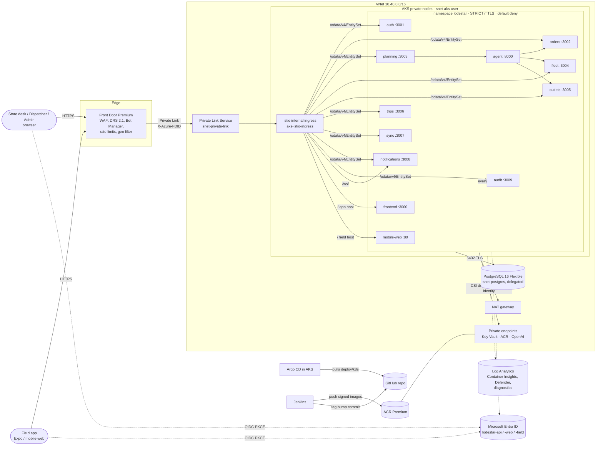

# Waypoint Lodestar · Azure infrastructure

> **What is applied, and what is not.** The live demo runs on **`envs/demo`** only: one VM, a static IP with an Azure DNS name, an NSG and a budget (see [`deploy/azure-demo/README.md`](../deploy/azure-demo/README.md)). Everything else on this page is **target architecture that was not applied**: `envs/dev`, `envs/prod` and the modules behind them (AKS with Istio, Front Door, Premium ACR, managed Postgres and Redis, Key Vault, Entra apps, Log Analytics), together with the AKS overlays `deploy/k8s/overlays/dev` and `deploy/k8s/overlays/prod`. Their cost is well beyond the event's $100 Azure credit. They are kept as the design for a production rollout.

Terraform for the Azure platform described in `docs/architecture/PLATFORM.md` §8. The live delivery path is **GitHub Actions → GHCR → the demo VM** (`.github/workflows/deploy-demo.yml`): the VM's compose stack deploys each green `main` run, or, after the cut-over in `deploy/argocd/README.md` ("Demo on k3s"), Argo CD core on the same VM's k3s syncs the tag bump CI commits to `deploy/k8s/overlays/demo`. On AKS (target, not applied) Argo CD would deliver the workloads from `deploy/` the same way. For the existing demo VM, install k3s by hand: `install_k3s = true` changes its `custom_data` and makes Terraform replace the VM.

```
infra/terraform/
  bootstrap/          remote-state Storage Account (run once, local state)
  modules/
    platform/         composition used by every environment (naming, tags, wiring)
    network/          VNet, subnets, NSGs, NAT gateway, private DNS zones
    aks/              AKS: CNI overlay + Cilium, workload identity, Istio, Policy, Defender, Insights, KV CSI
    acr/              Premium registry, private endpoint, AcrPull for kubelet
    postgres/         Flexible Server 16, private access, Entra auth, per-service roles/secrets
    keyvault/         RBAC vault, private endpoint, purge protection, ingress TLS cert
    identity/         Entra app registrations, workload identities, federated credentials, RBAC
    frontdoor/        Front Door Premium + WAF, Private Link origin to the Istio ingress
    monitoring/       Log Analytics, Container Insights, diagnostic settings
    argocd/           Helm: argo-cd + root app-of-apps
    openai/           Azure OpenAI (declared, enable_openai = false)
  envs/demo           APPLIED: one VM + static IP/DNS label + NSG + budget (the public demo)
  envs/dev, envs/prod target architecture, not applied (sizing in main.tf, tenant IDs in tfvars)
```

## Architecture



On Azure the local NGINX `gateway` is replaced by the Istio internal ingress gateway. It does the same routing (`deploy/k8s/base/istio/virtualservices.yaml`) and, like NGINX locally, makes no authorisation decisions of its own. The only exception is the Front Door lock.

## Zero-trust controls → resources

| PLATFORM.md §2 control | Where it is enforced |
|---|---|
| Identity for every call (JWT RS256, issuer/audience/expiry/signature) | Entra app `lodestar-api` (`modules/identity`), Istio `RequestAuthentication entra-jwt` + `requestPrincipals: ["*"]` in every `AuthorizationPolicy` (`deploy/k8s/base/istio`), plus each service's own verification (`OIDC_*` in `lodestar-common`) |
| Service identities (client credentials, no shared secrets) | One user-assigned identity per service account + federated credential (`azurerm_federated_identity_credential`). Pods exchange the projected SA token for an Entra token (client-assertion grant). This replaces the `svc-*` Keycloak clients and uses no client secrets. |
| Least privilege: roles | App roles `store_manager, dispatcher, loader, driver, admin, svc` on `lodestar-api`; `app_role_assignment_required = true`; groups → roles via `role_group_object_ids` |
| Least privilege: service scopes | App roles such as `orders.read`, `trips.write` and `agent.invoke` are assigned per workload (`local.services[*].api_roles` in `modules/platform`) and mirror the mesh edges |
| Least privilege: secrets | `Key Vault Secrets User` scoped to **each individual secret** a workload needs; per-service Postgres role `svc_<schema>` owning only its schema |
| Segmentation: mesh | Istio add-on, `PeerAuthentication` STRICT, `deny-all` + per-callee `AuthorizationPolicy` (caller SA principals) |
| Segmentation: L3/L4 | Cilium NetworkPolicies (default deny, caller→callee, Postgres only for `lodestar.io/db` pods); NSGs per subnet; Postgres delegated subnet, `public_network_access_enabled = false` |
| Private data plane | Private endpoints and private DNS for Key Vault and ACR (and OpenAI); Postgres VNet integration; AKS nodes without public IPs, egress through a NAT gateway; optional private API server (prod) |
| Edge | Front Door Premium, WAF in Prevention mode (Microsoft DRS 2.1, Bot Manager 1.1, per-IP and write rate limits, `/health` + `/ready` blocked, geo allow-list in prod), Private Link origin, Istio `require-frontdoor` (X-Azure-FDID) |
| Assume breach: containers | non-root, `readOnlyRootFilesystem`, drop ALL caps, seccomp RuntimeDefault, no SA token automount; Azure Policy add-on; Defender for Containers |
| Assume breach: secrets | `random_password` → Key Vault only; CSI driver with rotation; no secrets in git, images or tfvars; Key Vault purge protection |
| Assume breach: audit | Hash-chained `audit` service reachable by every workload; AKS `kube-audit-admin`, Key Vault `audit`, Front Door WAF logs → Log Analytics |
| Human access | AKS local accounts disabled, Entra RBAC (`Azure Kubernetes Service RBAC Cluster Admin` for platform admins only); Postgres Entra admin group; Key Vault RBAC |
| Device posture | `lodestar-field` public client (PKCE). Binding the `device_id` claim needs a claims-mapping policy (see "Open items") |

## Naming and tagging

`<abbr>-<project>-<env>-<region>`, for example `aks-lodestar-dev-sea`, `psql-lodestar-prod-sea` or `rg-lodestar-dev-sea`. Globally unique names add `unique_suffix`: `crlodestardev<suffix>` (ACR) and `kv-lodestar-dev-<suffix>` (Key Vault). Every resource carries the tags `project, environment, managed-by, repo, owner, cost-center`.

## Bootstrap (once per subscription)

Prerequisites: Terraform ≥ 1.7, Azure CLI, and `kubelogin` on the PATH. You also need an account that can create app registrations (Application Administrator) and assign roles (Owner or User Access Administrator).

```bash
az login
export ARM_SUBSCRIPTION_ID=<subscription-id>

cd infra/terraform/bootstrap
cp terraform.tfvars.example terraform.tfvars      # unique_suffix, Jenkins SP object id, IPs
terraform init
terraform apply
terraform output -json backend_hcl                # copy into envs/<env>/backend.hcl
```

Subscription prerequisites: register `Microsoft.ContainerService`, `Microsoft.Cdn`, `Microsoft.DBforPostgreSQL` and `Microsoft.KeyVault`. Enable Defender for Containers. Optionally enable the `EncryptionAtHost` feature.

## Plan and apply (per environment)

```bash
cd infra/terraform/envs/dev                       # or envs/prod
cp backend.hcl.example backend.hcl                # from bootstrap output
cp terraform.tfvars.example terraform.tfvars      # group/object IDs, hostnames, IPs; no secrets
terraform init -backend-config=backend.hcl
terraform fmt -check -recursive ../..
terraform validate
terraform plan  -out=tfplan
terraform apply tfplan
```

The first `apply` creates the network, AKS, ACR, Key Vault, Postgres, Entra apps, identities and Front Door (without origins). It then installs Argo CD and the root app. If the Kubernetes/Helm providers cannot reach a brand-new cluster in the same run, apply in two steps: `terraform apply -target=module.platform.module.aks`, then `terraform apply`.

After the first apply:

1. `terraform output -raw kustomize_azure_env > ../../../../deploy/k8s/overlays/dev/azure-wiring/azure.env` and commit it. It holds only non-secret IDs.
2. Import the real TLS certificate for `app.<domain>` and `field.<domain>`, replacing the self-signed placeholder:
   `az keyvault certificate import --vault-name <kv> -n lodestar-ingress-tls -f cert.pem`.
3. Argo CD syncs `deploy/k8s/overlays/dev`, which creates the Private Link Service `pls-lodestar-ingress`.
4. Set `frontdoor_origin_enabled = true` (and `ingress_internal_ip`) in tfvars and `terraform apply` again.
5. Approve Front Door's private endpoint connection on the PLS:
   `az network private-link-service connection update ... --connection-status Approved`, or in the portal.
6. Point DNS at the Front Door endpoints, optionally with `frontdoor_custom_domains_enabled = true` and `dns_zone_id`.

Prod uses a private AKS API server. Run Terraform from a Jenkins agent inside the VNet or a peered hub, with `kubelogin_mode = "workloadidentity"` (or `spn` with `AAD_SERVICE_PRINCIPAL_CLIENT_ID` and `AAD_SERVICE_PRINCIPAL_CLIENT_SECRET`). Public data planes (Key Vault, ACR, AKS API) are only open to `deployer_ip_ranges`. Leave that list empty to make them fully private.

## Jenkins (PLATFORM.md §7, step 5)

```groovy
withCredentials([azureServicePrincipal('azure-sp-lodestar')]) {   // or workload identity on the agent
  sh '''
    export ARM_CLIENT_ID=$AZURE_CLIENT_ID ARM_CLIENT_SECRET=$AZURE_CLIENT_SECRET \
           ARM_TENANT_ID=$AZURE_TENANT_ID ARM_SUBSCRIPTION_ID=$AZURE_SUBSCRIPTION_ID
    export AAD_SERVICE_PRINCIPAL_CLIENT_ID=$AZURE_CLIENT_ID AAD_SERVICE_PRINCIPAL_CLIENT_SECRET=$AZURE_CLIENT_SECRET
    cd infra/terraform/envs/${ENV}
    terraform init -input=false -backend-config=backend.hcl
    terraform plan -input=false -var kubelogin_mode=spn -out=tfplan
  '''
}
input message: "Apply ${ENV}?"
sh 'cd infra/terraform/envs/${ENV} && terraform apply -input=false tfplan'
```

`backend.hcl` and `terraform.tfvars` are provided as Jenkins secret files (`lodestar-tf-backend-<env>`, `lodestar-tfvars-<env>`). They contain IDs only, but they are kept out of git.

## Azure OpenAI

The agent uses `AGENT_MODEL=mock`. To switch later, set `enable_openai = true` to create the account, a private endpoint and a `Cognitive Services OpenAI User` role for the agent's workload identity only (API keys disabled). Then set `AGENT_MODEL=azure-openai` plus the endpoint and deployment name in `deploy/k8s/base/services/agent/configmap.yaml`.

## Open items

- `depot`, `outlet_id`, `vehicle_id` and `device_id` claims need Entra directory extension attributes and a claims-mapping policy (or token augmentation), which this code does not create.
- Argo CD SSO with Entra (OIDC app + group claims) is not configured. Until it is, the UI is reached through `kubectl port-forward` using Entra-authenticated kubectl.
